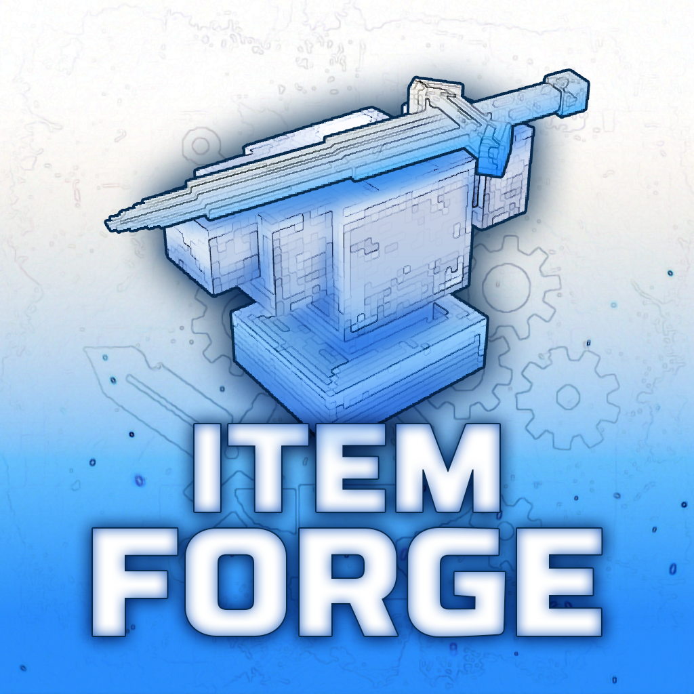

<p align="center">
  
</p>

<p align="center">
  Edit any item's stats live, from inside Hytale. Armor, weapons, tools, food, potions, recipes, anything. No JSON files, no restarts.
</p>

<p align="center">
  <b>Release 1.0.0</b>
</p>

---

## What It Does

You run `/itemforge` in game, pick an item from any installed mod, and change whatever you want. The change applies live, to every copy already in the world, no restart.

It works with items from any mod because it doesn't hardcode known types. It reads each item's real schema through Hytale's codec introspection, so whatever a mod adds, the fields just show up and are editable.

- **Live editing** - armor, weapons, tools, food, potions, gliders, containers. Changes apply instantly
- **Dashboard** - browse every item with search, filters (type, mod, quality, slot, status), sortable columns, grid or table view
- **Recipes** - edit, create from scratch, or remove. Bench and panel selection, input materials with item search
- **Custom name & lore** - set an item's name and description, either globally (the item type) or on the single stack a player is holding
- **Batch operations** - apply one edit across many items at once, with undo
- **Modded stats** - picks up stats other mods register (weapons and armor) and makes them editable, labelled with the mod they came from
- **Per-item and per-stack** - edit the shared base item, or just the stack in someone's hand
- **Inspect mode** - crouch and right-click a held item to open it straight in the editor
- **Audit log** - every change records who did what, and when
- **Permissions** - per-section gates for stats, recipes, general properties, and reset
- **Mod credits** - a `/credits` page lists every installed mod and its authors, so creators always get credited

## Commands

| Command | What it does |
|:--------|:-------------|
| `/itemforge` | Open the dashboard |
| `/itemforge <itemId>` | Open the editor for one item |
| `/itemforge edit <itemId>` | Same thing, explicit |
| `/itemforge reload` | Re-read the override files and apply them live |
| `/itemforge status` | Engine status |
| `/itemforge extensions` | List editor panels registered by other mods |
| `/credits` | List installed mods and their authors |

## Installation

**Players** - Nothing to do. ItemForge is server-side, no client setup.

**Server operators** - Drop `ItemForge-<version>.jar` into your server's `mods/` directory and start the server, then run `/itemforge` in game (needs admin permission). The UI runtime is bundled into the jar, so there is nothing else to install.

## Configuration

ItemForge writes `config.yml` to its data directory on first run. Item and recipe overrides are saved as JSON next to it and reapplied on restart.

### Anonymous metrics

ItemForge reports anonymous usage stats through [HStats](https://hstats.dev) : a random per-server id, the online player count, OS and Java version, CPU core count, and which mods are installed. No player names, no IPs, no world data, ever. Turn it off with one line in `config.yml` :

```yaml
metrics:
  enabled: false
```

## For Mod Developers

ItemForge already edits anything that lives on an item. If your mod keeps item data somewhere else (its own config, a separate registry, computed values), you can add your own panel to the editor :

```java
ItemForgeAPI.registerExtension(new MyExtension());
```

Your panel shows up as a source in the editor, drawn with ItemForge's own widgets. Full guide and a worked example : [docs/EXTENSIONS.md](docs/EXTENSIONS.md).

## Building from Source

Requires JDK 25 and Node.js (for the Vue UI).

```bash
./gradlew clean build
```

This compiles the Kotlin, builds the UI, and produces the jar in `build/libs/`. Architecture notes are in [docs/ARCHITECTURE.md](docs/ARCHITECTURE.md).

## License

- **Code** - [MIT](LICENSE)
- **Name, logo, and branding artwork** - © LadyPaladra & Larsonix, all rights reserved. Not covered by the MIT grant, and not for reuse to represent forks or derivatives.

Bundled third-party components keep their own licenses, listed in [THIRD-PARTY-NOTICES.md](THIRD-PARTY-NOTICES.md).

## Credits

- **Code** - Larsonix
- **Logo & branding** - LadyPaladra
- **Bundled `/credits` page** - [Creditor](https://github.com/Lordimass/Creditor) by Lordimass (MIT)
